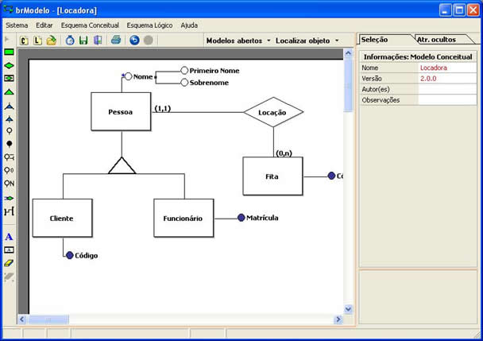

# Modelo Conceitual

O modelo de dados conceitual, representa um modelo abstrato dos dados independente do SGBD (Sistema Gerenciador de Banco de Dados).

Seu objetivo é identificar que informações podem aparecer no banco de dados e de que forma elas estão relacionadas. A técnica mais difundida é a modelagem entidade-relacionamento representada através do diagrama entidade-relacionamento (DER).

Exemplo de DER:

Você pode ler este diagrama da seguinte forma: "Um carro `possui uma` montadora, e uma montadora `possui N` carros`"

No exemplo acima temos `duas entidades` (Carro e Montadora) que são representadas pelos retângulos. O círculo preenchido (bolinha preta pintada) representa o `atributo identificador` da entidade. Os círculos vazios (bolinha branca) representam os `demais atributos` das entidades. O polígono ligando as duas entidades representa a `associação entre as entidades`.

## Criando sua própria modelagem conceitual
Você pode criar a modelagem conceitual manualmente. Se estiver à procura de uma ferramenta de código aberto para criar o modelo conceitual, recomendo o uso do brModelo ([sis4.com/brModelo](http://www.sis4.com/brModelo)). É uma ferramenta de código aberto criada em Delphi por Carlos Henrique Cândido, sob orientação do professor Dr. Ronaldo dos Santos Mello da UFSC (Universidade Federal de Santa Catarina).

Imagem coletada no site oficial da aplicação [sis4.com/brModelo](http://www.sis4.com/brModelo):
