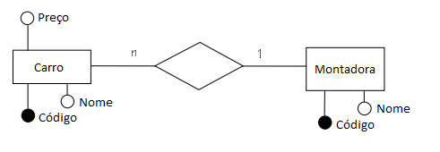

# Modelo Lógico

"Um *modelo lógico* é uma descrição de um banco de dados no nível de abstração visto pelo usuário do SGBD" (Heuser, 1998). Trata-se de uma representação textual daquilo que foi modelado conceitualmente.

A representação textual pode variar de acordo com o tipo do banco de dados (relacional, não relacional ou objeto relacional). Trataremos nesse livro apenas os SGBDs relacionais. 

Abaixo detalhamos o modelo lógico do diagrama criado no capítulo anterior. Vamos apresentar um modelo conceitual (1), modelo lógico (2) e um exemplo de planilha contendo os dados (3).

## 1 - Modelo Conceitual

## 2 - Modelo Lógico
Carro (__Codigo__, Nome, Preço, CodigoMontadora);
Montadora (__Codigo__, Nome);

## 3 - Exemplo de Tabela
**Montadora**

| Codigo | Nome |
| -- | -- |
| 1 | Ford |
| 2 | Volkswagen |

**Carro**

| Codigo | Nome | Preço | CodigoMontadora |
| -- | -- |
| 1 | Ka | 30.000 | 1 |
| 2 | Gol | 35.000 | 2 |
| 2 | Voyage | 47.000 | 2 |

